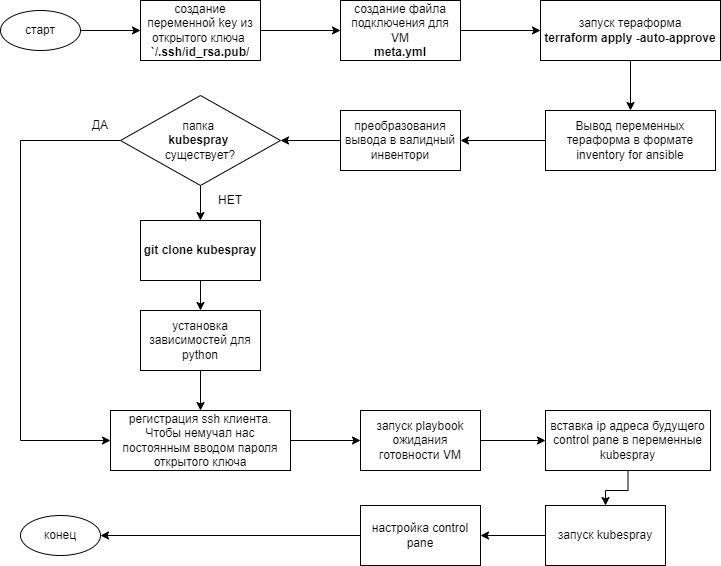

#### Скрипт установки инфраструктуры и kubernetes

* [Инструкция по запуску](#инструкция-по-запуску)
* [Описание файлов](#описание-файлов)
* [Схема работы скрипта](#схема-работы-скрипта)
* [Планы на будущее или что можно было бы сделать лучше](#планы-на-будущее-или-что-можно-было-бы-сделать-лучше)

---

#### Инструкция по запуску

*Необходимые инструменты для работы*

+ Terraform
+ Ansible
+ Python
+ Git

*Генерация ssh-ключа*

По умолчанию скрипт берет ssh-ключ для работы из домашней директории `~/.ssh/id_rsa.pub`. Если его нет, то можно сгенерировать (либо пересоздать):

```bash
ssh-keygen -t rsa
```
Далее следовать инструкции (имя оставить по умолчанию).

*Установка прав на исполнение*

После копирования файлов скрипта нужно установить тип файла как "запускаемый" для `run.sh`

```bash
sudo chmod +x run.sh
```

*Запуск скрипта*

```bash
./run.sh 
```

---

#### Описание файлов

+ **Scripts** - папка для скриптов, содержит в себе:
    + **convert_inventory_file.py** - python скрипт для преобразования выходных переменных  `terraform` в корректный `inventory.yaml` для `ansible`
    + **kube-config-create.sh** - файл с `bash` командами для внутренней настройки `kubernetes control pane`
+  **temp** - папка для временных манипуляций с файлами
+ **template** - папка шаблонов необходимых файлов, содержит в себе:
    + **cp_ip_address.j2** - шаблон для получения временного файла с ip control pane, чтобы добавить его в переменные `kubespray` (настройка доступа из вне к кластеру)
    + **inventory.yml.tpl** - шаблон инвентори для `ansible`
    + **meta.yml.tpl** - шаблон для создания файла настроек пользователя на создаваемых машинах при помощи `terraform`
+ **wait.yml** - playbook для ожидания готовности создаваемых виртуальных машин
+ **create-kube-config.yml** - playbook для настройки `kubernetes` control pane
+ **get_ip.yml** - получение ip control pane для добавления его в переменные `kubespray`
+ **main.tf** - главный файл инструкций для `terraform`

#### Схема работы скрипта



#### Планы на будущее или что можно было бы сделать лучше

+ Файл `main.tf` заточен под мои учетные данные. Наверное было бы лучше научить скрипт запрашивать их у пользователя при старте. Либо проверять конфиг файл с этими данными. Если их нет, то прекращать работу.

+ Все инструкции для `ansible` "упаковать в роли" и объединить в единый файл

+ Автоматическую генерацию ssh-ключа в начале работы скрипта